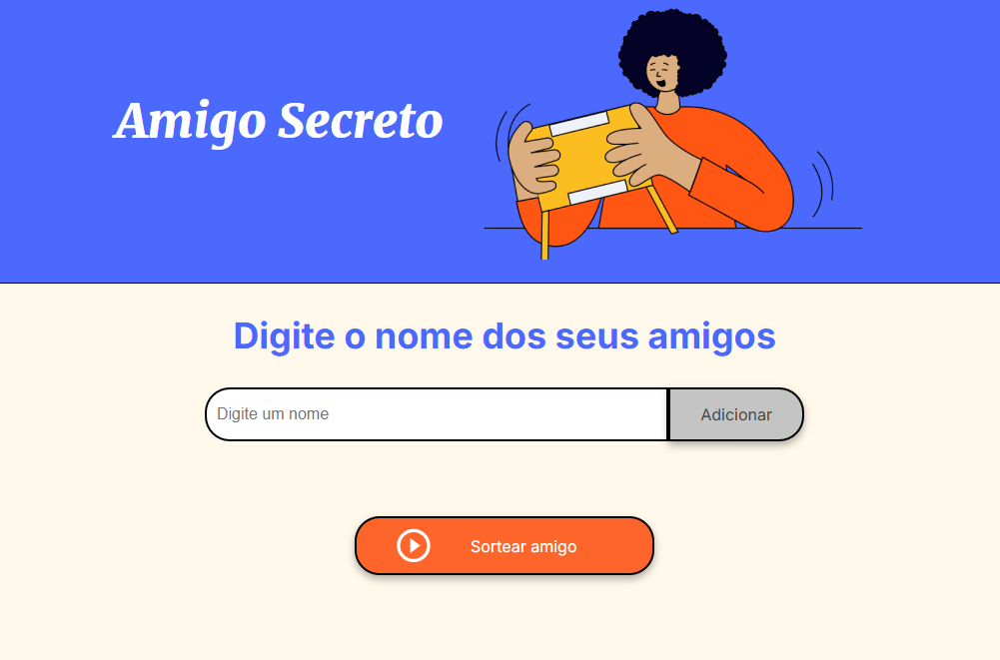
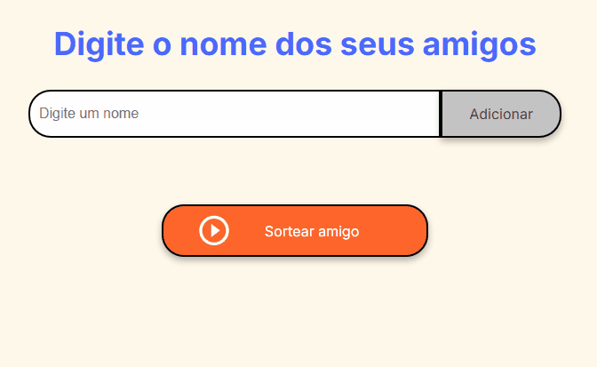
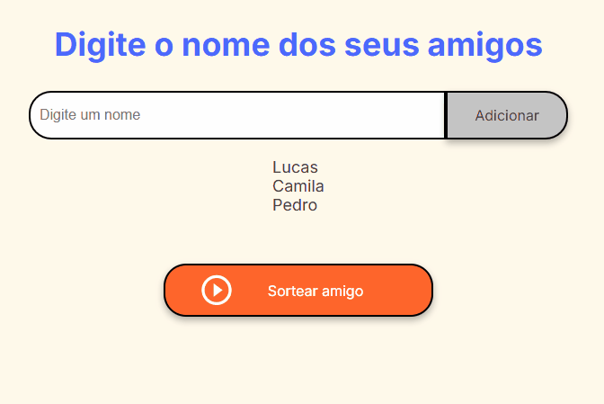

# challenger-amigo-secreto-alura-oneNextEducation

---

  

Neste desafio, você desenvolverá uma aplicação que permita aos usuários inserir nomes de amigos em uma lista para, em seguida, realizar um sorteio aleatório e determinar quem é o "amigo secreto".

O usuário deverá adicionar nomes por meio de um campo de texto e de um botão "Adicionar".

Os nomes inseridos serão exibidos em uma lista visível na página, e ao finalizar, um botão "Sortear Amigo" selecionará um dos nomes de forma aleatória, exibindo o resultado na tela.

---

## Funcionalidades:

- **Adicionar nomes:** Os usuários escreverão o nome de um amigo em um campo de texto e o adicionarão a uma lista visível ao clicar em "Adicionar".
  

  
  

- **Validar entrada:** Se o campo de texto estiver vazio, o programa exibirá um alerta solicitando um nome válido.
  

  
  

- **Visualizar a lista:** Os nomes inseridos aparecerão em uma lista abaixo do campo de entrada.
  

  
  

- **Sorteio aleatório:** Ao clicar no botão "Sortear Amigo", um nome da lista será selecionado aleatoriamente e exibido na página.
  

  
  

